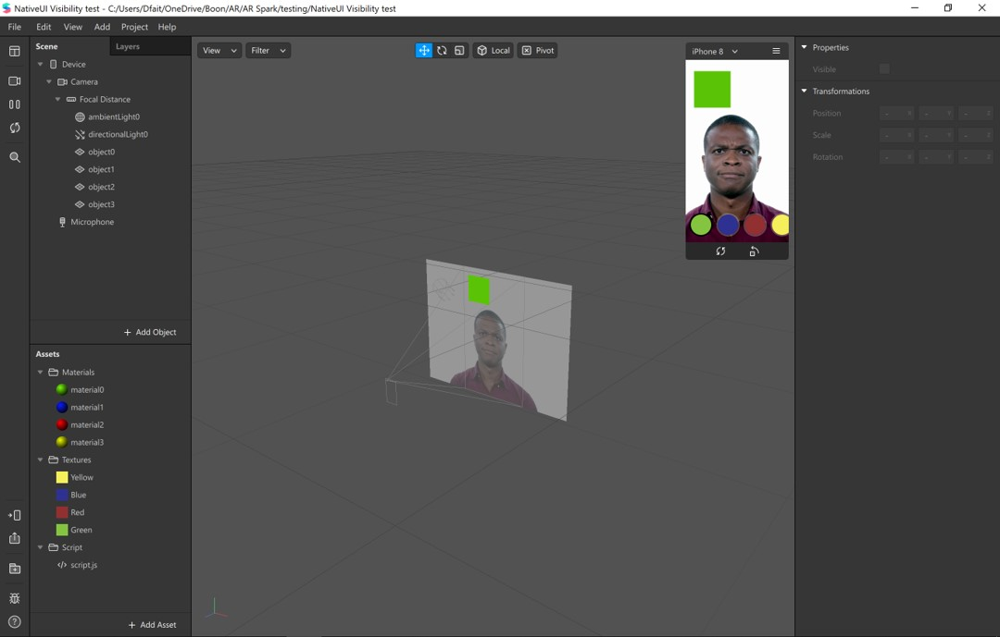

# Using Native UI Picker in Spark AR to toggle visibility of object For Instagram Filters

This project file demonstrate how you can toggle visibility of objects using native UI pickers for your Instagram filters. 

You can also go to the 

[tutorial]: https://www.gowaaa.com/post/using-native-ui-picker-in-spark-ar-to-toggle-visibility-of-object-for-instagram-filters

 to find out more on how you can use this project file. 